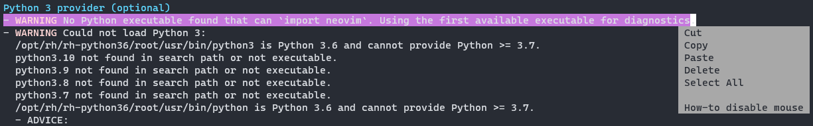

# Troubleshooting in vim and nvim

<!--toc:start-->

- [Troubleshooting in vim and nvim](#troubleshooting-in-vim-and-nvim)
  - [case study](#case-study)
  - [solution](#solution)
- [Can't copy text in windows terminal using mouse](#cant-copy-text-in-windows-terminal-using-mouse)
  - [case study](#case-study)
  - [solution](#solution)
- [Initialization that you don't want to put inside init file](#initialization-that-you-dont-want-to-put-inside-init-file)
  - [case study](#case-study)
  - [solution](#solution)
  - [example](#example)
- [Script doesn't take effect automatically, but you can use them directly](#script-doesnt-take-effect-automatically-but-you-can-use-them-directly)
<!--toc:end-->

### case study

Not sure if intended, `:help` cannot locate documentation for `packer` plugin.

### solution

It seems that what's following `:help` command are help tags (see `:help :helptags`), so we should run `:helptags <document path>` to update the help tags file.

```vim
" document for packer is located at ~/.local/share/nvim/site/pack/packer/start/packer.nvim/doc/
:helptags ~/.local/share/nvim/site/pack/packer/start/packer.nvim/doc/
```

## Can't copy text in windows terminal using mouse

### case study

In a windows terminal, when selecting text with mouse and you can see the following pop-up window,

the mouse is enabled **in neovim**. In this scenario, text copy/paste handled by windows terminal won't work, for those actions are actually yank/paste happening inside neovim/vim.

### solution

To copy/paste text in/out to the windows system, we can temporarily disable mouse in vim.

```vim
" for more information, see :help diable-mouse
setlocal mouse=
" setting it back after you're done
setlocal mouse=nvi
```

## Initialization that you don't want to put inside init file

### case study

There may be some settings you don't want to put inside your init file, if they are local to the machine you're using, you may want to put them somewhere else.

### solution

Files under the config path (see `:help standard-path`) are automatically sourced, so we can put a machine-specific script as plugin under `${HOME}/.config/nvim/plugin/<machine-specific>.vim

### example

```vim
" in ~/.config/nvim/plugin/my-machine.vim
" set the python provider program for this machine
let g:python3_host_prog = "/opt/rh/rh-python36/root/usr/bin/python3.6"
```

## Script doesn't take effect automatically, but you can use them directly

When writing `autoload` scripts, updating `.vimrc`/`init.lua`, if the scripts don't take effect, But running the content of a script or source the script manually work, check the obvious: is the script **actually run**?

- Maybe print out some message in the script
- Check the script is in the runtime path

I encountered this problem since my symbolic link to the vim config is broken:

```
# expected
~/.vim -> ~/dotfiles/.vim
# actually
~/.vim
    .vim -> ~/dotfiles/.vim
```

This happens because if `.vim` folder doesn't exist and was created by vim first launch, afterward doing `ln -s ~/dotfiles/.vim ~/.vim` will only create a symbolic link under the existing `~/.vim` folder.
Now every updates put into `~/dotfiles/.vim` will not take effect obviously, the updated scripts simply will not be sourced.
