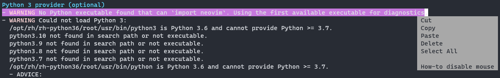

# Trouble shooting in vim/nvim
<!--toc:start-->
- [Trouble shooting in vim/nvim](#trouble-shooting-in-vimnvim)
  - [`:help` cannot locate document for plugin](#help-cannot-locate-document-for-plugin)
<!--toc:end-->

## `:help` cannot locate document for plugin
### case study
Not sure if intended, `:help` cannot locate documentation for `packer` plugin.

### solution
It seems that what's following `:help` command are help tags (see `:help :helptags`), so we should run `:helptags <document path>` to update the help tags file.
```vim
" document for packer is located at ~/.local/share/nvim/site/pack/packer/start/packer.nvim/doc/
:helptags ~/.local/share/nvim/site/pack/packer/start/packer.nvim/doc/
```

## Can't copy text in windows terminal using mouse
### case study
In a windows terminal, when selecting text with mouse and you can see the following pop-up window,

the mouse is enabled **in neovim**. In this scenario, text copy/paste handled by windows terminal won't work, for those actions are actually yank/paste happening inside neovim/vim.

### solution
To copy/paste text in/out to the windows system, we can temporarily disable mouse in vim.
```vim
" for more information, see :help diable-mouse 
setlocal mouse=
" setting it back after you're done
setlocal mouse=nvi
```
