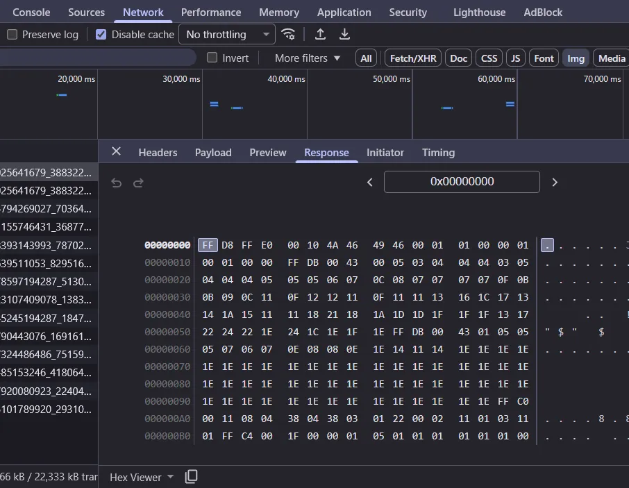

# Miscellaneous topics

<!--toc:start-->

- [Miscellaneous topics](#miscellaneous-topics)
  - [Download response to file](#download-response-to-file)
  <!--toc:end-->

## Download response to file

Say a site doesn't let us download a video from the UI, in chrome developer tool,
usually `Network` > `Media` we can find the resource url and click on it to
download or open it in a new tab.

However some site doesn't let you download the resource even if you have the url.
In this case we can still view the response payload.


Now we can copy the entire payload clicking the copy button beside the
`Hex Viewer` option. Paste the content into a blank file and convert
the hex blob back into binary:

```sh
# -p for hexdump w/o line number info. see man xxd
# from stdin
cat <hexdump> | xxd -r -p > <binary>
# or
xxd -r -p <hexdump> <binary>
```
